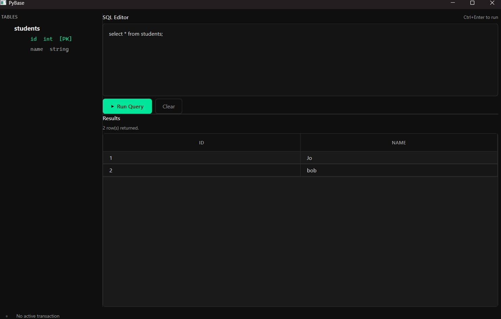

# PyBase


PyBase is a minimal relational database engine built from scratch in Python. It implements real database internals -custom binary storage, B-Tree indexing, schema persistence, constraints, and transactions -without any external libraries.

---

## Features

- **Full CRUD** -`CREATE TABLE`, `INSERT`, `SELECT`, `UPDATE`, `DELETE`, `DROP TABLE`
- **SQL-like syntax** -case-insensitive keywords and column names
- **File-based persistence** -rows stored in binary `.db` files, schema in `.schema` JSON files
- **Schema persistence** -table definitions, constraints, and indexes survive restarts
- **B-Tree indexing** -`CREATE INDEX` for O(log n) equality lookups
- **Column constraints** -`PRIMARY KEY`, `UNIQUE`, NOT NULL enforcement
- **Rich WHERE clauses** -`=`, `!=`, `>`, `>=`, `<`, `<=` with `AND` support
- **Column projection** -`SELECT name, id FROM ...` or `SELECT *`
- **ORDER BY** -`ASC` and `DESC` on any column
- **LIMIT** -cap result set size
- **Transactions** -`BEGIN`, `COMMIT`, `ROLLBACK` with operation buffering
- **Desktop GUI** -built with PyQt6, includes SQL editor, results table, schema browser, and transaction status

---

## Architecture

```
pybase/
├── core/
│   ├── __init__.py
│   ├── database.py         # Database registry, table lifecycle, transaction management
│   ├── table.py            # Table operations, constraint enforcement, query execution
│   └── transaction.py      # Transaction buffer -BEGIN / COMMIT / ROLLBACK
├── gui/
│   ├── __init__.py
│   ├── main.py             # QApplication entry point
│   ├── main_window.py      # MainWindow -assembles all panels
│   ├── panels/
│   │   ├── __init__.py
│   │   ├── editor.py       # SQL editor + run button
│   │   ├── results.py      # Results table
│   │   └── schema.py       # Schema browser
│   └── widgets/
│       ├── __init__.py
│       └── status_bar.py   # Transaction status indicator
├── query/
│   └── __init__.py         # Reserved for future query planner / optimizer
├── storage/
│   ├── __init__.py
│   ├── btree.py            # B-Tree and BTreeNode data structures
│   ├── index_manager.py    # Owns and manages B-Tree indexes per table
│   ├── pager.py            # Binary row file read/write
│   ├── schema_manager.py   # JSON schema persistence per table
│   └── serializer.py       # Row serialization to/from bytes
├── tests/
│   └── test_pybase.py      # Full test suite -67 tests
├── __init__.py
├── .gitignore
├── cli.py                  # SQL parser and REPL entry point
└── README.md
```

### Layer Responsibilities

| Layer                       | Responsibility                                                |
| --------------------------- | ------------------------------------------------------------- |
| `cli.py`                    | Parse SQL strings, dispatch to database, print results        |
| `core/database.py`          | Own all tables, manage transactions, reload tables on startup |
| `core/table.py`             | Validate and execute all row operations, enforce constraints  |
| `core/transaction.py`       | Buffer operations, apply or discard at commit/rollback        |
| `storage/pager.py`          | Append rows to disk, rewrite file after delete/update         |
| `storage/serializer.py`     | Convert rows to fixed-width binary and back                   |
| `storage/schema_manager.py` | Write and read per-table `.schema` JSON files                 |
| `storage/btree.py`          | Sorted key-value tree with O(log n) search                    |
| `storage/index_manager.py`  | Create, rebuild, and query B-Tree indexes                     |
| `gui/`                      | PyQt6 desktop interface -editor, results, schema browser      |

---

## Getting Started

### Requirements

- Python 3.10+
- PyQt6 (GUI only)

```bash
pip install PyQt6
```

### Run CLI

```bash
cd pybase
python cli.py
```

### Run GUI

```bash
cd pybase
python -m gui.main
```

---

### Preview




## Supported SQL Syntax

### DDL

```sql
-- Create a table
CREATE TABLE users (id int PRIMARY KEY, name string);
CREATE TABLE products (id int PRIMARY KEY, name string, price int UNIQUE);

-- Drop a table
DROP TABLE users;

-- Create a B-Tree index
CREATE INDEX ON users (id);
```

### DML

```sql
-- Insert a row
INSERT INTO users VALUES (1, 'Alice');

-- Select all rows
SELECT * FROM users;

-- Select with column projection
SELECT name FROM users;

-- Select with WHERE clause
SELECT * FROM users WHERE id = 1;
SELECT * FROM users WHERE id >= 2 AND id != 4;

-- Select with ORDER BY
SELECT * FROM users ORDER BY name ASC;
SELECT * FROM users ORDER BY id DESC;

-- Select with LIMIT
SELECT * FROM users LIMIT 5;

-- Full SELECT with all clauses
SELECT name FROM users WHERE id > 1 ORDER BY name ASC LIMIT 10;

-- Update rows
UPDATE users SET name = 'Alice2' WHERE id = 1;

-- Delete rows
DELETE FROM users WHERE id = 1;
```

### Transactions

```sql
BEGIN;
INSERT INTO users VALUES (3, 'Charlie');
INSERT INTO users VALUES (4, 'Dave');
COMMIT;

BEGIN;
INSERT INTO users VALUES (5, 'Eve');
ROLLBACK;
-- Eve is never written to disk
```

---

## Data Types

| Type     | Python equivalent | Storage size                     |
| -------- | ----------------- | -------------------------------- |
| `int`    | `int`             | 4 bytes (signed)                 |
| `string` | `str`             | 256 bytes (1 length + 255 chars) |

---

## Constraints

| Constraint     | Behavior                             |
| -------------- | ------------------------------------ |
| `PRIMARY KEY`  | UNIQUE + NOT NULL, one per table     |
| `UNIQUE`       | No duplicate values in the column    |
| Duplicate rows | Exact duplicate rows always rejected |

---

## Persistence

Each table produces two files in the `data/` directory:

| File                | Contents                                   |
| ------------------- | ------------------------------------------ |
| `table_name.db`     | Fixed-width binary row data                |
| `table_name.schema` | JSON -columns, types, constraints, indexes |

On startup, the database scans `data/` for `.schema` files and reloads all tables automatically, including rebuilding B-Tree indexes into memory.

---

## Transactions

PyBase uses an **in-memory write buffer** model:

- `BEGIN` starts buffering `INSERT`, `UPDATE`, and `DELETE` operations
- `COMMIT` applies all buffered operations to the live tables and disk
- `ROLLBACK` discards the buffer -nothing is written
- `SELECT` always reads live data, even inside a transaction
- `DROP TABLE` is blocked inside a transaction
- Nested transactions are not supported

---

## Testing

```bash
cd pybase
pytest tests/ -v
```

67 tests covering CRUD, constraints, B-Tree indexes, transactions, and persistence.
